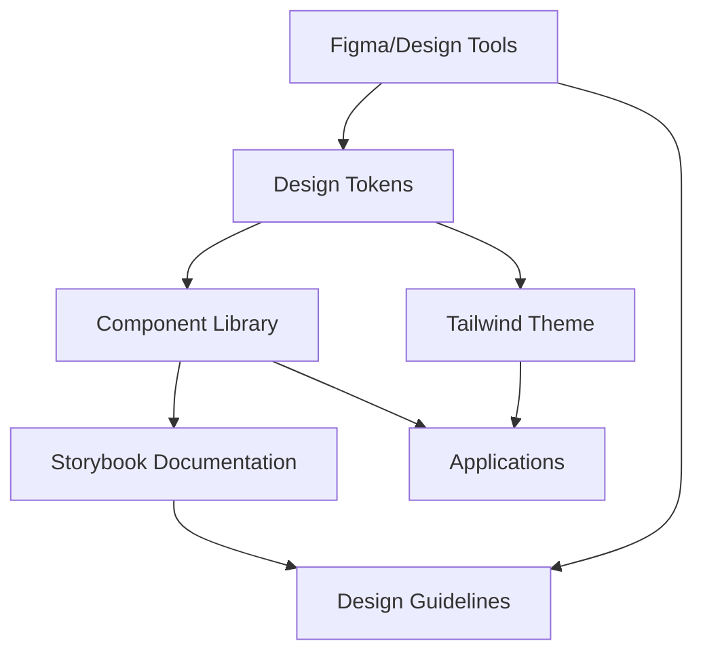

# 🎨 Design Systems

Comprehensive guide to building scalable, consistent design systems with design tokens, Tailwind theming, and Storybook documentation.

## 📋 Quick Summary

A design system is a collection of reusable components, guided by clear standards, that can be assembled together to build applications. It includes design tokens for consistent styling, component libraries, documentation, and tooling to maintain consistency across products.

**Key Benefits:**
- **Consistency** - Unified visual language across all products
- **Efficiency** - Faster development with reusable components
- **Scalability** - Easy to maintain and update across multiple projects
- **Collaboration** - Better communication between design and development
- **Quality** - Reduced bugs and improved accessibility

---

## 🏗️ Design System Architecture



### Core Components

1. **Design Tokens** - Atomic design decisions (colors, spacing, typography)
2. **Component Library** - Reusable UI components
3. **Documentation** - Usage guidelines and examples
4. **Tooling** - Build tools, linting, testing
5. **Guidelines** - Design principles and best practices

---

## 🎯 Design Tokens

Design tokens are the atomic elements of a design system - the smallest design decisions that make up a cohesive visual language.

### Token Categories

```typescript
// Design token structure
interface DesignTokens {
  colors: ColorTokens;
  typography: TypographyTokens;
  spacing: SpacingTokens;
  shadows: ShadowTokens;
  borders: BorderTokens;
  animations: AnimationTokens;
  breakpoints: BreakpointTokens;
}
```

### Color Tokens

```typescript
// tokens/colors.ts
export const colors = {
  // Semantic colors
  primary: {
    50: '#eff6ff',
    100: '#dbeafe',
    200: '#bfdbfe',
    300: '#93c5fd',
    400: '#60a5fa',
    500: '#3b82f6', // Base primary
    600: '#2563eb',
    700: '#1d4ed8',
    800: '#1e40af',
    900: '#1e3a8a',
    950: '#172554',
  },
  
  // Neutral colors
  neutral: {
    0: '#ffffff',
    50: '#f9fafb',
    100: '#f3f4f6',
    200: '#e5e7eb',
    300: '#d1d5db',
    400: '#9ca3af',
    500: '#6b7280',
    600: '#4b5563',
    700: '#374151',
    800: '#1f2937',
    900: '#111827',
    950: '#030712',
  },
  
  // Status colors
  success: {
    50: '#f0fdf4',
    500: '#22c55e',
    600: '#16a34a',
    700: '#15803d',
  },
  
  warning: {
    50: '#fffbeb',
    500: '#f59e0b',
    600: '#d97706',
    700: '#b45309',
  },
  
  error: {
    50: '#fef2f2',
    500: '#ef4444',
    600: '#dc2626',
    700: '#b91c1c',
  },
  
  // Semantic aliases
  background: {
    primary: '#ffffff',
    secondary: '#f9fafb',
    tertiary: '#f3f4f6',
  },
  
  text: {
    primary: '#111827',
    secondary: '#6b7280',
    tertiary: '#9ca3af',
    inverse: '#ffffff',
  },
  
  border: {
    primary: '#e5e7eb',
    secondary: '#d1d5db',
    focus: '#3b82f6',
  },
} as const;

// Type-safe color access
export type ColorToken = keyof typeof colors;
export type ColorShade = keyof typeof colors.primary;
```

### Typography Tokens

```typescript
// tokens/typography.ts
export const typography = {
  fontFamily: {
    sans: ['Inter', 'system-ui', 'sans-serif'],
    serif: ['Georgia', 'serif'],
    mono: ['JetBrains Mono', 'monospace'],
  },
  
  fontSize: {
    xs: ['0.75rem', { lineHeight: '1rem' }],
    sm: ['0.875rem', { lineHeight: '1.25rem' }],
    base: ['1rem', { lineHeight: '1.5rem' }],
    lg: ['1.125rem', { lineHeight: '1.75rem' }],
    xl: ['1.25rem', { lineHeight: '1.75rem' }],
    '2xl': ['1.5rem', { lineHeight: '2rem' }],
    '3xl': ['1.875rem', { lineHeight: '2.25rem' }],
    '4xl': ['2.25rem', { lineHeight: '2.5rem' }],
    '5xl': ['3rem', { lineHeight: '1' }],
    '6xl': ['3.75rem', { lineHeight: '1' }],
  },
  
  fontWeight: {
    thin: '100',
    extralight: '200',
    light: '300',
    normal: '400',
    medium: '500',
    semibold: '600',
    bold: '700',
    extrabold: '800',
    black: '900',
  },
  
  letterSpacing: {
    tighter: '-0.05em',
    tight: '-0.025em',
    normal: '0em',
    wide: '0.025em',
    wider: '0.05em',
    widest: '0.1em',
  },
  
  lineHeight: {
    none: '1',
    tight: '1.25',
    snug: '1.375',
    normal: '1.5',
    relaxed: '1.625',
    loose: '2',
  },
} as const;
```

### Spacing Tokens

```typescript
// tokens/spacing.ts
export const spacing = {
  0: '0px',
  px: '1px',
  0.5: '0.125rem',   // 2px
  1: '0.25rem',      // 4px
  1.5: '0.375rem',   // 6px
  2: '0.5rem',       // 8px
  2.5: '0.625rem',   // 10px
  3: '0.75rem',      // 12px
  3.5: '0.875rem',   // 14px
  4: '1rem',         // 16px
  5: '1.25rem',      // 20px
  6: '1.5rem',       // 24px
  7: '1.75rem',      // 28px
  8: '2rem',         // 32px
  9: '2.25rem',      // 36px
  10: '2.5rem',      // 40px
  11: '2.75rem',     // 44px
  12: '3rem',        // 48px
  14: '3.5rem',      // 56px
  16: '4rem',        // 64px
  20: '5rem',        // 80px
  24: '6rem',        // 96px
  28: '7rem',        // 112px
  32: '8rem',        // 128px
  36: '9rem',        // 144px
  40: '10rem',       // 160px
  44: '11rem',       // 176px
  48: '12rem',       // 192px
  52: '13rem',       // 208px
  56: '14rem',       // 224px
  60: '15rem',       // 240px
  64: '16rem',       // 256px
  72: '18rem',       // 288px
  80: '20rem',       // 320px
  96: '24rem',       // 384px
} as const;

// Semantic spacing aliases
export const semanticSpacing = {
  // Component spacing
  component: {
    xs: spacing[1],    // 4px
    sm: spacing[2],    // 8px
    md: spacing[4],    // 16px
    lg: spacing[6],    // 24px
    xl: spacing[8],    // 32px
  },
  
  // Layout spacing
  layout: {
    xs: spacing[4],    // 16px
    sm: spacing[6],    // 24px
    md: spacing[8],    // 32px
    lg: spacing[12],   // 48px
    xl: spacing[16],   // 64px
    '2xl': spacing[24], // 96px
  },
} as const;
```

### Shadow Tokens

```typescript
// tokens/shadows.ts
export const shadows = {
  none: 'none',
  sm: '0 1px 2px 0 rgb(0 0 0 / 0.05)',
  base: '0 1px 3px 0 rgb(0 0 0 / 0.1), 0 1px 2px -1px rgb(0 0 0 / 0.1)',
  md: '0 4px 6px -1px rgb(0 0 0 / 0.1), 0 2px 4px -2px rgb(0 0 0 / 0.1)',
  lg: '0 10px 15px -3px rgb(0 0 0 / 0.1), 0 4px 6px -4px rgb(0 0 0 / 0.1)',
  xl: '0 20px 25px -5px rgb(0 0 0 / 0.1), 0 8px 10px -6px rgb(0 0 0 / 0.1)',
  '2xl': '0 25px 50px -12px rgb(0 0 0 / 0.25)',
  inner: 'inset 0 2px 4px 0 rgb(0 0 0 / 0.05)',
  
  // Semantic shadows
  card: '0 1px 3px 0 rgb(0 0 0 / 0.1), 0 1px 2px -1px rgb(0 0 0 / 0.1)',
  dropdown: '0 10px 15px -3px rgb(0 0 0 / 0.1), 0 4px 6px -4px rgb(0 0 0 / 0.1)',
  modal: '0 25px 50px -12px rgb(0 0 0 / 0.25)',
  focus: '0 0 0 3px rgb(59 130 246 / 0.5)',
} as const;
```

### Token Management with Style Dictionary

```bash
# Install Style Dictionary
npm install style-dictionary --save-dev
```

```javascript
// style-dictionary.config.js
const StyleDictionary = require('style-dictionary');

module.exports = {
  source: ['tokens/**/*.json'],
  platforms: {
    // CSS Custom Properties
    css: {
      transformGroup: 'css',
      buildPath: 'dist/css/',
      files: [{
        destination: 'tokens.css',
        format: 'css/variables'
      }]
    },
    
    // JavaScript/TypeScript
    js: {
      transformGroup: 'js',
      buildPath: 'dist/js/',
      files: [{
        destination: 'tokens.js',
        format: 'javascript/es6'
      }]
    },
    
    // Tailwind CSS
    tailwind: {
      transformGroup: 'js',
      buildPath: 'dist/tailwind/',
      files: [{
        destination: 'tokens.js',
        format: 'javascript/object'
      }]
    },
    
    // React Native
    reactNative: {
      transformGroup: 'react-native',
      buildPath: 'dist/react-native/',
      files: [{
        destination: 'tokens.js',
        format: 'javascript/es6'
      }]
    }
  }
};
```

```json
// tokens/colors.json
{
  "color": {
    "primary": {
      "50": { "value": "#eff6ff" },
      "100": { "value": "#dbeafe" },
      "500": { "value": "#3b82f6" },
      "900": { "value": "#1e3a8a" }
    },
    "semantic": {
      "background": {
        "primary": { "value": "{color.neutral.0.value}" },
        "secondary": { "value": "{color.neutral.50.value}" }
      },
      "text": {
        "primary": { "value": "{color.neutral.900.value}" },
        "secondary": { "value": "{color.neutral.600.value}" }
      }
    }
  }
}
```

---

## 🎨 Tailwind CSS Theming

Integrating design tokens with Tailwind CSS for a cohesive styling system.

### Tailwind Configuration

```javascript
// tailwind.config.js
const { colors, typography, spacing, shadows } = require('./tokens');

/** @type {import('tailwindcss').Config} */
module.exports = {
  content: [
    './src/**/*.{js,ts,jsx,tsx}',
    './components/**/*.{js,ts,jsx,tsx}',
    './pages/**/*.{js,ts,jsx,tsx}',
  ],
  
  theme: {
    // Override default colors completely
    colors: {
      transparent: 'transparent',
      current: 'currentColor',
      ...colors,
    },
    
    // Extend default theme
    extend: {
      fontFamily: typography.fontFamily,
      fontSize: typography.fontSize,
      fontWeight: typography.fontWeight,
      letterSpacing: typography.letterSpacing,
      lineHeight: typography.lineHeight,
      spacing: spacing,
      boxShadow: shadows,
      
      // Custom utilities
      borderRadius: {
        'none': '0px',
        'sm': '0.125rem',
        'base': '0.25rem',
        'md': '0.375rem',
        'lg': '0.5rem',
        'xl': '0.75rem',
        '2xl': '1rem',
        '3xl': '1.5rem',
        'full': '9999px',
      },
      
      // Animation tokens
      animation: {
        'fade-in': 'fadeIn 0.2s ease-in-out',
        'slide-up': 'slideUp 0.3s ease-out',
        'scale-in': 'scaleIn 0.2s ease-out',
      },
      
      keyframes: {
        fadeIn: {
          '0%': { opacity: '0' },
          '100%': { opacity: '1' },
        },
        slideUp: {
          '0%': { transform: 'translateY(10px)', opacity: '0' },
          '100%': { transform: 'translateY(0)', opacity: '1' },
        },
        scaleIn: {
          '0%': { transform: 'scale(0.95)', opacity: '0' },
          '100%': { transform: 'scale(1)', opacity: '1' },
        },
      },
    },
  },
  
  plugins: [
    require('@tailwindcss/forms'),
    require('@tailwindcss/typography'),
    require('@tailwindcss/aspect-ratio'),
    
    // Custom plugin for component classes
    function({ addComponents, theme }) {
      addComponents({
        '.btn': {
          padding: `${theme('spacing.2')} ${theme('spacing.4')}`,
          borderRadius: theme('borderRadius.md'),
          fontWeight: theme('fontWeight.medium'),
          fontSize: theme('fontSize.sm'),
          lineHeight: theme('lineHeight.tight'),
          transition: 'all 0.2s ease-in-out',
          cursor: 'pointer',
          display: 'inline-flex',
          alignItems: 'center',
          justifyContent: 'center',
          gap: theme('spacing.2'),
          
          '&:focus': {
            outline: 'none',
            boxShadow: theme('boxShadow.focus'),
          },
          
          '&:disabled': {
            opacity: '0.5',
            cursor: 'not-allowed',
          },
        },
        
        '.btn-primary': {
          backgroundColor: theme('colors.primary.500'),
          color: theme('colors.white'),
          
          '&:hover:not(:disabled)': {
            backgroundColor: theme('colors.primary.600'),
          },
          
          '&:active:not(:disabled)': {
            backgroundColor: theme('colors.primary.700'),
          },
        },
        
        '.btn-secondary': {
          backgroundColor: theme('colors.neutral.100'),
          color: theme('colors.neutral.700'),
          border: `1px solid ${theme('colors.neutral.300')}`,
          
          '&:hover:not(:disabled)': {
            backgroundColor: theme('colors.neutral.200'),
          },
        },
        
        '.card': {
          backgroundColor: theme('colors.background.primary'),
          borderRadius: theme('borderRadius.lg'),
          boxShadow: theme('boxShadow.card'),
          padding: theme('spacing.6'),
        },
      });
    },
  ],
};
```

### CSS Custom Properties Integration

```css
/* styles/globals.css */
@tailwind base;
@tailwind components;
@tailwind utilities;

:root {
  /* Design tokens as CSS custom properties */
  --color-primary-50: theme('colors.primary.50');
  --color-primary-500: theme('colors.primary.500');
  --color-primary-900: theme('colors.primary.900');
  
  --spacing-xs: theme('spacing.1');
  --spacing-sm: theme('spacing.2');
  --spacing-md: theme('spacing.4');
  --spacing-lg: theme('spacing.6');
  
  --font-size-sm: theme('fontSize.sm');
  --font-size-base: theme('fontSize.base');
  --font-size-lg: theme('fontSize.lg');
}

/* Dark mode support */
@media (prefers-color-scheme: dark) {
  :root {
    --color-background-primary: theme('colors.neutral.900');
    --color-text-primary: theme('colors.neutral.100');
  }
}

[data-theme='dark'] {
  --color-background-primary: theme('colors.neutral.900');
  --color-text-primary: theme('colors.neutral.100');
}
```

### Theme Provider Component

```tsx
// components/ThemeProvider.tsx
import React, { createContext, useContext, useEffect, useState } from 'react';

type Theme = 'light' | 'dark' | 'system';

interface ThemeContextType {
  theme: Theme;
  setTheme: (theme: Theme) => void;
  resolvedTheme: 'light' | 'dark';
}

const ThemeContext = createContext<ThemeContextType | undefined>(undefined);

export function ThemeProvider({ children }: { children: React.ReactNode }) {
  const [theme, setTheme] = useState<Theme>('system');
  const [resolvedTheme, setResolvedTheme] = useState<'light' | 'dark'>('light');

  useEffect(() => {
    const stored = localStorage.getItem('theme') as Theme;
    if (stored) {
      setTheme(stored);
    }
  }, []);

  useEffect(() => {
    localStorage.setItem('theme', theme);
    
    if (theme === 'system') {
      const mediaQuery = window.matchMedia('(prefers-color-scheme: dark)');
      setResolvedTheme(mediaQuery.matches ? 'dark' : 'light');
      
      const handler = (e: MediaQueryListEvent) => {
        setResolvedTheme(e.matches ? 'dark' : 'light');
      };
      
      mediaQuery.addEventListener('change', handler);
      return () => mediaQuery.removeEventListener('change', handler);
    } else {
      setResolvedTheme(theme);
    }
  }, [theme]);

  useEffect(() => {
    document.documentElement.setAttribute('data-theme', resolvedTheme);
    document.documentElement.classList.toggle('dark', resolvedTheme === 'dark');
  }, [resolvedTheme]);

  return (
    <ThemeContext.Provider value={{ theme, setTheme, resolvedTheme }}>
      {children}
    </ThemeContext.Provider>
  );
}

export function useTheme() {
  const context = useContext(ThemeContext);
  if (!context) {
    throw new Error('useTheme must be used within ThemeProvider');
  }
  return context;
}
```

---

## 📚 Storybook Setup

Storybook provides an isolated environment for developing and documenting UI components.

### Installation and Configuration

```bash
# Initialize Storybook
npx storybook@latest init

# Install additional addons
npm install --save-dev @storybook/addon-docs @storybook/addon-controls @storybook/addon-viewport @storybook/addon-backgrounds @storybook/addon-a11y
```

### Storybook Configuration

```typescript
// .storybook/main.ts
import type { StorybookConfig } from '@storybook/react-vite';

const config: StorybookConfig = {
  stories: ['../src/**/*.stories.@(js|jsx|ts|tsx|mdx)'],
  
  addons: [
    '@storybook/addon-links',
    '@storybook/addon-essentials',
    '@storybook/addon-interactions',
    '@storybook/addon-docs',
    '@storybook/addon-controls',
    '@storybook/addon-viewport',
    '@storybook/addon-backgrounds',
    '@storybook/addon-a11y',
  ],
  
  framework: {
    name: '@storybook/react-vite',
    options: {},
  },
  
  typescript: {
    check: false,
    reactDocgen: 'react-docgen-typescript',
    reactDocgenTypescriptOptions: {
      shouldExtractLiteralValuesFromEnum: true,
      propFilter: (prop) => (prop.parent ? !/node_modules/.test(prop.parent.fileName) : true),
    },
  },
  
  docs: {
    autodocs: 'tag',
  },
};

export default config;
```

```typescript
// .storybook/preview.ts
import type { Preview } from '@storybook/react';
import '../src/styles/globals.css'; // Import Tailwind styles

const preview: Preview = {
  parameters: {
    actions: { argTypesRegex: '^on[A-Z].*' },
    
    controls: {
      matchers: {
        color: /(background|color)$/i,
        date: /Date$/,
      },
    },
    
    backgrounds: {
      default: 'light',
      values: [
        { name: 'light', value: '#ffffff' },
        { name: 'dark', value: '#1f2937' },
        { name: 'neutral', value: '#f9fafb' },
      ],
    },
    
    viewport: {
      viewports: {
        mobile: {
          name: 'Mobile',
          styles: { width: '375px', height: '667px' },
        },
        tablet: {
          name: 'Tablet',
          styles: { width: '768px', height: '1024px' },
        },
        desktop: {
          name: 'Desktop',
          styles: { width: '1024px', height: '768px' },
        },
      },
    },
    
    docs: {
      toc: true,
    },
  },
  
  globalTypes: {
    theme: {
      description: 'Global theme for components',
      defaultValue: 'light',
      toolbar: {
        title: 'Theme',
        icon: 'paintbrush',
        items: [
          { value: 'light', title: 'Light' },
          { value: 'dark', title: 'Dark' },
        ],
        dynamicTitle: true,
      },
    },
  },
};

export default preview;
```

### Component Story Examples

```tsx
// components/Button/Button.stories.tsx
import type { Meta, StoryObj } from '@storybook/react';
import { Button } from './Button';

const meta: Meta<typeof Button> = {
  title: 'Components/Button',
  component: Button,
  parameters: {
    layout: 'centered',
    docs: {
      description: {
        component: 'A versatile button component with multiple variants and sizes.',
      },
    },
  },
  tags: ['autodocs'],
  argTypes: {
    variant: {
      control: 'select',
      options: ['primary', 'secondary', 'outline', 'ghost'],
      description: 'The visual style variant of the button',
    },
    size: {
      control: 'select',
      options: ['sm', 'md', 'lg'],
      description: 'The size of the button',
    },
    disabled: {
      control: 'boolean',
      description: 'Whether the button is disabled',
    },
    loading: {
      control: 'boolean',
      description: 'Whether the button is in a loading state',
    },
    onClick: { action: 'clicked' },
  },
};

export default meta;
type Story = StoryObj<typeof meta>;

export const Primary: Story = {
  args: {
    variant: 'primary',
    children: 'Button',
  },
};

export const Secondary: Story = {
  args: {
    variant: 'secondary',
    children: 'Button',
  },
};

export const AllVariants: Story = {
  render: () => (
    <div className="flex gap-4">
      <Button variant="primary">Primary</Button>
      <Button variant="secondary">Secondary</Button>
      <Button variant="outline">Outline</Button>
      <Button variant="ghost">Ghost</Button>
    </div>
  ),
  parameters: {
    docs: {
      description: {
        story: 'All available button variants displayed together.',
      },
    },
  },
};

export const AllSizes: Story = {
  render: () => (
    <div className="flex items-center gap-4">
      <Button size="sm">Small</Button>
      <Button size="md">Medium</Button>
      <Button size="lg">Large</Button>
    </div>
  ),
};

export const WithIcons: Story = {
  render: () => (
    <div className="flex gap-4">
      <Button variant="primary">
        <svg className="w-4 h-4" fill="currentColor" viewBox="0 0 20 20">
          <path fillRule="evenodd" d="M10 3a1 1 0 011 1v5h5a1 1 0 110 2h-5v5a1 1 0 11-2 0v-5H4a1 1 0 110-2h5V4a1 1 0 011-1z" clipRule="evenodd" />
        </svg>
        Add Item
      </Button>
      <Button variant="secondary">
        Download
        <svg className="w-4 h-4" fill="currentColor" viewBox="0 0 20 20">
          <path fillRule="evenodd" d="M3 17a1 1 0 011-1h12a1 1 0 110 2H4a1 1 0 01-1-1zm3.293-7.707a1 1 0 011.414 0L9 10.586V3a1 1 0 112 0v7.586l1.293-1.293a1 1 0 111.414 1.414l-3 3a1 1 0 01-1.414 0l-3-3a1 1 0 010-1.414z" clipRule="evenodd" />
        </svg>
      </Button>
    </div>
  ),
};

export const LoadingStates: Story = {
  render: () => (
    <div className="flex gap-4">
      <Button loading>Loading...</Button>
      <Button variant="secondary" loading>Loading...</Button>
    </div>
  ),
};

export const DisabledStates: Story = {
  render: () => (
    <div className="flex gap-4">
      <Button disabled>Disabled</Button>
      <Button variant="secondary" disabled>Disabled</Button>
    </div>
  ),
};
```

### Documentation with MDX

```mdx
<!-- components/Button/Button.stories.mdx -->
import { Canvas, Meta, Story, ArgsTable } from '@storybook/addon-docs';
import { Button } from './Button';

<Meta title="Design System/Button" component={Button} />

# Button

The Button component is a fundamental interactive element used throughout the application. It supports multiple variants, sizes, and states to accommodate different use cases.

## Design Principles

- **Clarity**: Button labels should be clear and action-oriented
- **Consistency**: Use consistent styling across the application
- **Accessibility**: All buttons should be keyboard accessible and screen reader friendly
- **Feedback**: Provide visual feedback for different states (hover, active, disabled)

## Usage Guidelines

### When to use
- For primary actions (form submissions, confirmations)
- For navigation between pages or sections
- For triggering modals, dropdowns, or other UI elements

### When not to use
- For navigation that should use links instead
- For actions that are better suited to other controls (toggles, checkboxes)

## Variants

<Canvas>
  <Story name="Variants">
    <div className="flex gap-4">
      <Button variant="primary">Primary</Button>
      <Button variant="secondary">Secondary</Button>
      <Button variant="outline">Outline</Button>
      <Button variant="ghost">Ghost</Button>
    </div>
  </Story>
</Canvas>

### Primary
Use for the most important action on a page. There should typically be only one primary button visible at a time.

### Secondary
Use for secondary actions that are important but not the primary focus.

### Outline
Use for actions that need less visual weight than secondary buttons.

### Ghost
Use for subtle actions or in contexts where minimal visual impact is desired.

## Accessibility

- All buttons include proper ARIA labels
- Keyboard navigation is fully supported
- Focus indicators meet WCAG contrast requirements
- Loading and disabled states are announced to screen readers

## API

<ArgsTable of={Button} />
```

### Design Tokens in Storybook

```tsx
// stories/DesignTokens.stories.tsx
import type { Meta, StoryObj } from '@storybook/react';
import { colors, typography, spacing } from '../tokens';

const meta: Meta = {
  title: 'Design System/Design Tokens',
  parameters: {
    layout: 'padded',
    docs: {
      description: {
        component: 'Visual representation of design tokens used throughout the system.',
      },
    },
  },
};

export default meta;

export const Colors: StoryObj = {
  render: () => (
    <div className="space-y-8">
      <div>
        <h3 className="text-lg font-semibold mb-4">Primary Colors</h3>
        <div className="grid grid-cols-10 gap-2">
          {Object.entries(colors.primary).map(([shade, color]) => (
            <div key={shade} className="text-center">
              <div 
                className="w-16 h-16 rounded-lg mb-2 border border-neutral-200"
                style={{ backgroundColor: color }}
              />
              <div className="text-xs font-mono">{shade}</div>
              <div className="text-xs text-neutral-600 font-mono">{color}</div>
            </div>
          ))}
        </div>
      </div>
      
      <div>
        <h3 className="text-lg font-semibold mb-4">Neutral Colors</h3>
        <div className="grid grid-cols-10 gap-2">
          {Object.entries(colors.neutral).map(([shade, color]) => (
            <div key={shade} className="text-center">
              <div 
                className="w-16 h-16 rounded-lg mb-2 border border-neutral-200"
                style={{ backgroundColor: color }}
              />
              <div className="text-xs font-mono">{shade}</div>
              <div className="text-xs text-neutral-600 font-mono">{color}</div>
            </div>
          ))}
        </div>
      </div>
    </div>
  ),
};

export const Typography: StoryObj = {
  render: () => (
    <div className="space-y-6">
      <div>
        <h3 className="text-lg font-semibold mb-4">Font Sizes</h3>
        {Object.entries(typography.fontSize).map(([size, [fontSize, { lineHeight }]]) => (
          <div key={size} className="flex items-baseline gap-4 py-2">
            <div className="w-16 text-sm font-mono text-neutral-600">{size}</div>
            <div style={{ fontSize, lineHeight }}>
              The quick brown fox jumps over the lazy dog
            </div>
            <div className="text-xs font-mono text-neutral-500">
              {fontSize} / {lineHeight}
            </div>
          </div>
        ))}
      </div>
      
      <div>
        <h3 className="text-lg font-semibold mb-4">Font Weights</h3>
        {Object.entries(typography.fontWeight).map(([weight, value]) => (
          <div key={weight} className="flex items-center gap-4 py-2">
            <div className="w-24 text-sm font-mono text-neutral-600">{weight}</div>
            <div style={{ fontWeight: value }} className="text-lg">
              The quick brown fox jumps over the lazy dog
            </div>
            <div className="text-xs font-mono text-neutral-500">{value}</div>
          </div>
        ))}
      </div>
    </div>
  ),
};

export const Spacing: StoryObj = {
  render: () => (
    <div className="space-y-6">
      <h3 className="text-lg font-semibold mb-4">Spacing Scale</h3>
      {Object.entries(spacing).slice(0, 20).map(([token, value]) => (
        <div key={token} className="flex items-center gap-4">
          <div className="w-12 text-sm font-mono text-neutral-600">{token}</div>
          <div 
            className="bg-primary-500 h-4"
            style={{ width: value }}
          />
          <div className="text-xs font-mono text-neutral-500">{value}</div>
        </div>
      ))}
    </div>
  ),
};
```

---

## 🔧 Component Development Workflow

### 1. Design Token Definition
```typescript
// Define tokens first
export const buttonTokens = {
  padding: {
    sm: `${spacing[1]} ${spacing[3]}`,
    md: `${spacing[2]} ${spacing[4]}`,
    lg: `${spacing[3]} ${spacing[6]}`,
  },
  fontSize: {
    sm: typography.fontSize.sm,
    md: typography.fontSize.base,
    lg: typography.fontSize.lg,
  },
} as const;
```

### 2. Component Implementation
```tsx
// components/Button/Button.tsx
import React from 'react';
import { cva, type VariantProps } from 'class-variance-authority';
import { cn } from '../../utils/cn';

const buttonVariants = cva(
  // Base styles
  'inline-flex items-center justify-center gap-2 rounded-md font-medium transition-colors focus-visible:outline-none focus-visible:ring-2 focus-visible:ring-primary-500 focus-visible:ring-offset-2 disabled:pointer-events-none disabled:opacity-50',
  {
    variants: {
      variant: {
        primary: 'bg-primary-500 text-white hover:bg-primary-600 active:bg-primary-700',
        secondary: 'bg-neutral-100 text-neutral-900 hover:bg-neutral-200 border border-neutral-300',
        outline: 'border border-primary-500 text-primary-500 hover:bg-primary-50 active:bg-primary-100',
        ghost: 'text-primary-500 hover:bg-primary-50 active:bg-primary-100',
      },
      size: {
        sm: 'h-8 px-3 text-sm',
        md: 'h-10 px-4 text-base',
        lg: 'h-12 px-6 text-lg',
      },
    },
    defaultVariants: {
      variant: 'primary',
      size: 'md',
    },
  }
);

export interface ButtonProps
  extends React.ButtonHTMLAttributes<HTMLButtonElement>,
    VariantProps<typeof buttonVariants> {
  loading?: boolean;
}

export const Button = React.forwardRef<HTMLButtonElement, ButtonProps>(
  ({ className, variant, size, loading, disabled, children, ...props }, ref) => {
    return (
      <button
        className={cn(buttonVariants({ variant, size, className }))}
        ref={ref}
        disabled={disabled || loading}
        {...props}
      >
        {loading && (
          <svg className="animate-spin -ml-1 mr-2 h-4 w-4" fill="none" viewBox="0 0 24 24">
            <circle className="opacity-25" cx="12" cy="12" r="10" stroke="currentColor" strokeWidth="4" />
            <path className="opacity-75" fill="currentColor" d="M4 12a8 8 0 018-8V0C5.373 0 0 5.373 0 12h4zm2 5.291A7.962 7.962 0 014 12H0c0 3.042 1.135 5.824 3 7.938l3-2.647z" />
          </svg>
        )}
        {children}
      </button>
    );
  }
);

Button.displayName = 'Button';
```

### 3. Testing
```tsx
// components/Button/Button.test.tsx
import { render, screen, fireEvent } from '@testing-library/react';
import { Button } from './Button';

describe('Button', () => {
  it('renders correctly', () => {
    render(<Button>Click me</Button>);
    expect(screen.getByRole('button', { name: 'Click me' })).toBeInTheDocument();
  });

  it('handles click events', () => {
    const handleClick = jest.fn();
    render(<Button onClick={handleClick}>Click me</Button>);
    
    fireEvent.click(screen.getByRole('button'));
    expect(handleClick).toHaveBeenCalledTimes(1);
  });

  it('shows loading state', () => {
    render(<Button loading>Loading</Button>);
    expect(screen.getByRole('button')).toBeDisabled();
  });

  it('applies variant classes correctly', () => {
    render(<Button variant="secondary">Secondary</Button>);
    expect(screen.getByRole('button')).toHaveClass('bg-neutral-100');
  });
});
```

### 4. Documentation
```tsx
// Create comprehensive Storybook stories
// Include usage examples, accessibility notes, and API documentation
```

---

## 🎯 Best Practices

### 1. **Token Naming Conventions**
```typescript
// Use semantic naming over descriptive
// Good
const colors = {
  primary: { 500: '#3b82f6' },
  text: { primary: '#111827' },
};

// Avoid
const colors = {
  blue: { 500: '#3b82f6' },
  darkGray: '#111827',
};
```

### 2. **Component API Design**
```tsx
// Consistent prop naming and behavior
interface ComponentProps {
  variant?: 'primary' | 'secondary';  // Use variant for style variations
  size?: 'sm' | 'md' | 'lg';         // Use size for sizing
  disabled?: boolean;                 // Use boolean flags for states
  loading?: boolean;
  children: React.ReactNode;          // Always type children properly
}
```

### 3. **Accessibility First**
```tsx
// Always include proper ARIA attributes
<button
  aria-label={loading ? 'Loading...' : undefined}
  aria-disabled={disabled}
  role="button"
  tabIndex={disabled ? -1 : 0}
>
  {children}
</button>
```

### 4. **Performance Optimization**
```tsx
// Use React.memo for pure components
export const Button = React.memo(React.forwardRef<HTMLButtonElement, ButtonProps>(
  ({ className, variant, size, ...props }, ref) => {
    // Component implementation
  }
));

// Use CSS-in-JS libraries efficiently
const buttonVariants = cva(/* styles */, {
  // Define variants once, reuse everywhere
});
```

---

## 🔗 Related Topics

- [[Tailwind CSS]] - Utility-first CSS framework
- [[React]] - Component development
- [[Component Design Patterns]] - Advanced component patterns
- [[Accessibility]] - Making components accessible
- [[Testing]] - Testing design system components

---

## 📚 Additional Resources

- [Design Tokens W3C Specification](https://design-tokens.github.io/community-group/format/)
- [Storybook Documentation](https://storybook.js.org/docs)
- [Tailwind CSS Documentation](https://tailwindcss.com/docs)
- [Style Dictionary](https://amzn.github.io/style-dictionary/)
- [Design Systems Handbook](https://www.designbetter.co/design-systems-handbook)

---

*Last updated: January 27, 2025* 